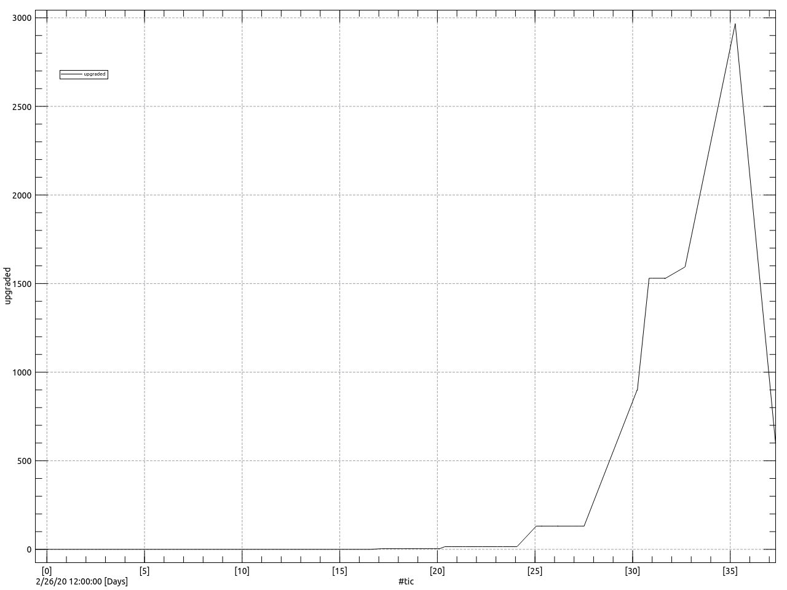

# README: Humanity Love Upgrade daily status in Switzerland ...

## on 03/29/20 06:00:39 ([snapshot](https://ipfs.io/ipfs/QmZyR83Sw1xX4vG5v2G6sTgYYmtY8rQQBBYyy93zkK2YvM))

 1530 souls have been upgraded with the LovID20 download

last update : <https://ipfs.blockringtm.ml/ipfs/QmZyR83Sw1xX4vG5v2G6sTgYYmtY8rQQBBYyy93zkK2YvM/lovid20.html>

 
+Michel

--- 

Every Sunday: 1:30pm 1:45pm Meditation & OM chanting ([#OMEKSAATH][OM]) CET
https://www.facebook.com/events/138981234204300

TODAY AND ALL THE FOLLOWING DAYS : AT [12:30H AND 21:00H][CLAP]
to be solidaire and to encourage our medical workers for their protection and service,
lets' get out on our balcony or at our windows and clap to express our immense gratitude
Please pass this message arround and take care of yourself and love ones.

[OM]: https://qwant.com/?q=%26g+%23OMEKSAATH
[CLAP]: https://www.facebook.com/mgcombs/posts/10223045570354511?__cft__[0]=AZU1uoBTRJPo_ZEqs8vur5Vri1R96Mio1M-vFXGeuWxFhfQHMHY6_zYneCuXuez2Ojcj9K2Ph7AHwHYQvsmxphJqN-KWkpAuTph-dTy5h9pGEE-zRT6rqOZx5RfWRscw2vY&__tn__=%2CO%2CP-R

---

 

 csv file [lovid.csv](lovid.csv) 
 data file [lovid.dat](lovid.dat)

sources:
  - <https://twitter.com/BAG_OFSP_UFSP>
  - <https://michel47.github.io/lovid20>
  - <https://github.com/michel47/lovid20>
  - <https://duckduckgo.com/?q=progression+lovid20>
  - <https://gateway.ipfs.io/ipfs/QmNrwXX9USAqTW1Nf3bTdFocbKV7nDUMgSJvZGT4B8D7tt>
  - <https://gateway.ipfs.io/ipfs/>
  - <https://gateway.ipfs.io/ipfs/QmZyR83Sw1xX4vG5v2G6sTgYYmtY8rQQBBYyy93zkK2YvM>
  
